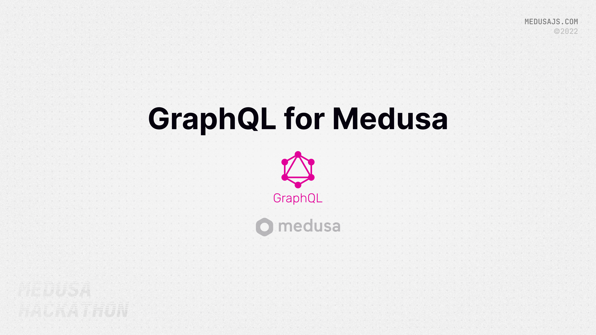

## Medusa Graphql API



## About

### Participants

Mithun Kamath

- Github  | @callmekatootie
- Twitter | @callmekatootie
- Discord | @callmekatootie#5679

### Description

A GraphQL api for [Medusajs](https://medusajs.com/). It currently wraps the existing [Store REST api](https://docs.medusajs.com/api/store/) and support for Admin REST api will be added based on demand.

### Preview


## Set up Project

### Prerequisites

- [Medusa Server](https://docs.medusajs.com/quickstart/quick-start). You may need to install additional plugins, depending on the api(s) / queries and mutations that you perform. Read Medusajs's documentation for know more.
- [Nodejs](https://nodejs.org/en/) (16+)

### Environment variables

You can set the following environment variables during deployment. For local deployment, create a `.env` file and set your variables

```bash
MEDUSA_SERVER // Your Medusa server endpoint address
NODE_ENV // You can set to `development` to get verbose errors
PORT // Port at which you would like to run the graphql server. Defaults to 4000
```

### Install and Deploy Project

1. Clone this repository

  ```bash
  $ git clone https://github.com/suhailkakar/react-native-medusajs
  ```

2. Install dependencies

  ```bash
  $ cd react-native-medusajs
  $ npm install
  ```

3. Set [environment variables](#environment-variables)
4. Start the app

  ```bash
  $ npm start
  > medusajs-graphql@1.0.0 start
  > node index.js

  🧘 Yoga -   Running GraphQL Server at http://0.0.0.0:4000/graphql
  ```

  That's it. You can access the graphql api at http://0.0.0.0:4000/graphql

### Authentication

For store related api(s), you will need follow the Authentication instructions located in the [Store REST api documentation](https://docs.medusajs.com/api/store/#section/Authentication). Once you obtain the `{sid}` bit (the string _after_ `connect.sid=`), you will invoke the graphql api with the following header:

```js
{
  "x-api-key": "{sid}"
}
```

Using an example from the Store REST api documentation, your final header would be:

```js
{
  "x-api-key": "s%3A2Bu8BkaP9JUfHu9rG59G16Ma0QZf6Gj1.WT549XqX37PN8n0OecqnMCq798eLjZC5IT7yiDCBHPM"
}
```

## Points to note

- `metadata` is an object in the source api. Graphql converts it to a string (`JSON.stringify()`) when it retrieves the value. When you are passing a value for this field in a mutation, pass the `JSON.strigify()`'ed version of it 
- enum fields need to be in UPPERCASE. 

## Implemented Endpoints

Refer to [TODO.md](./TODO.md) for complete list of implemented endpoints

## References

- [Medusa Storefront API](https://docs.medusajs.com/api/store/)
- [Medusa Admin API](https://docs.medusajs.com/api/admin/)
